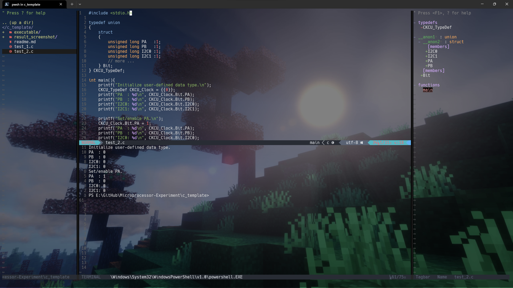
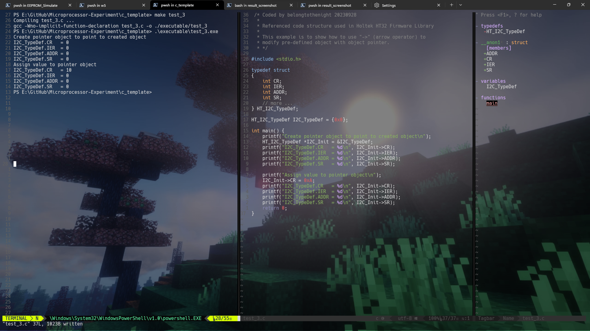

# C Template

Compile and execute with ```gcc test_1.c -o ./executable/test_1 && ./executable/test_1``` (shell), ```gcc test_1.c -o ./executable/test_1 && ./executable/test_1.exe``` (powershell).

## test_1.c


## test_2.c



## test_3.c


