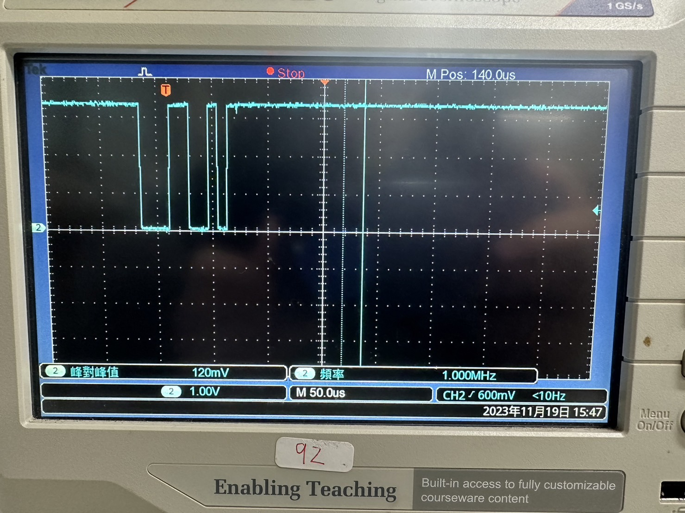

# USART / Interrupt | Experiment Steps

## Preparation

1. Go to "~/HT32_STD_5xxxx_FWLib_V1.5.1_7084/example/USART/Interrupt".
2. Execute "_CreateProject.bat".
3. Launch 52352 project.

## Homework 10-1

Objective: Display data when received exactly or more than 5 characters.

Hint:

1. Check the jumper and serial port.
2. Do not use ```RETARGET_Configuration()``` function.
3. If failed, check Tera Term settings: character encoding, local echo, and baudrate.

<details><summary>Experiment Steps: (Click to see more)</summary>

1. After powered on and loaded with modified code, every 5 characters you typed should be displayed on Tera Term.

</details>

Result: <https://youtu.be/iAOwg1B_CXc>

## Homework 10-2

Objective: Send two characters and observe the waveform.

Hint:

1. Connect Tx to BNC wire.
2. Edit code.

<details><summary>Experiment Steps: (Click to see more)</summary>

1. Modify code.
2. Connect wire.
   1. USART Tx to BNC positive (RED).
   2. GND to BNC negative (BLACK).
3. Adjust oscilloscope by adjusting trigger settings.
4. After powered on and loaded with modified code, once you typed two characters, you should see the signal waveform on screen.

</details>



## Homework 10-3 Bonus

Objective: Display corresponding name after entering student ID.

Hint:

1. Don't use function ```RETARGET_Configuration()``` and ```scanf()```.
2. Tera Term enable ```local echo```.
3. Follow code example.

Result: <https://youtu.be/sFXiJXmTTYE>
