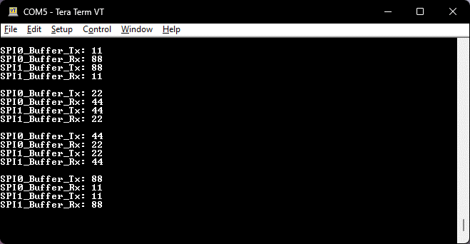
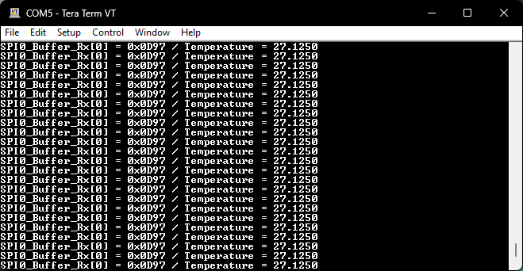

# SPI / Interrupt | Experiment Steps

## Preparation

1. Go to "~/HT32_STD_5xxxx_FWLib_V1.5.1_7084/example/SPI/Interrupt".
2. Execute "_CreateProject.bat".
3. Launch 52352 project.

## Homework 6-1

Objective: Connet circuit and edit the code.

Hint:

1. Use key "F12" to locate specified pins and connect them.
2. Wire up. (p7)
3. Edit code. (p26)

Experiment Steps: (Click to see more)

1. Connect ESK32-30501 dev-board to ESK300 eval-board and bread board. (not powered)
   1. SPI0_SEL to SPI1_SEL.
   2. SPI0_SCK to SPI1_SCK.
   3. SPI0_MOSI to SPI1_MOSI.
   4. SPI0_MISO to SPI1_MISO.
2. After powered on and loaded with modified code, tera term should show message in the following picture.
   1. 

Result: <https://youtu.be/lA0dsZUfvKI>

## Homework 6-2

Objective: Use JP10 to read temperature from TC77.

Hint:

1. Connect SCK, SEL and MISO pins.
2. Modify code (P32, 33)
3. Print results on Tera Term.
   1. 

Experiment Steps: (Click to see more)

1. Modify code.
2. Connect ESK32-30501 dev-board to ESK300 eval-board and bread board. (not powered)
   1. VDD to 3V3.
   2. GND to GND.
   3. SCK to SCK.
   4. SEL to CS.
   5. MISO to SI/O
3. After powered on and loaded with modified code, normal temperature should be displayed on Tera Term.

Result: <https://youtu.be/alLRYzyeQVI>
