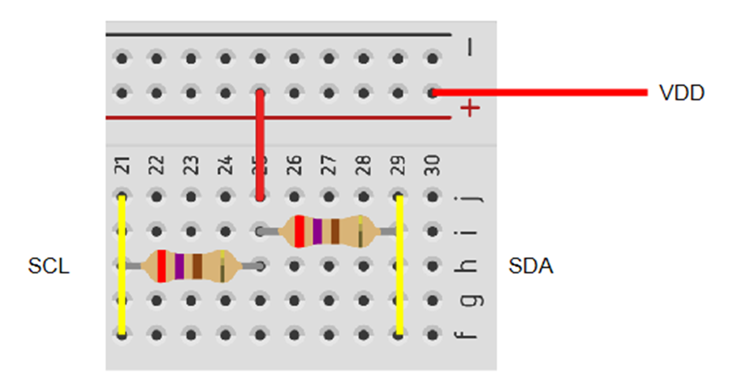

# SPI / Interrupt | Experiment Steps

## Preparation

1. Go to "~/HT32_STD_5xxxx_FWLib_V1.5.1_7084/example/SPI/Interrupt".
2. Execute "_CreateProject.bat".
3. Launch 52352 project.

## Homework 6-1

Objective: Connet circuit and edit the code.

Hint:

1. Use key "F12" to locate specified pins and connect them.
2. Wire up. (p7)
3. Edit code. (p26)

<details><summary>Experiment Steps:</summary>

1. Connect ESK32-30501 dev-board to ESK300 eval-board and bread board. (not powered)
   1. VDD to 3V3.
   2. GND to GND.
   3. 
2. After powered on and loaded with modified code, only LED1/D7 should be on.
   1. LED1/D7 off: Transfer failed.
   2. LED2/D8 on: Transfer failed.

</details>

Result: <https://youtu.be/DjRtjLKtLHk>

## Homework 5-2

Objective: Display I2C transfer result with Tera Term.

Hint:

1. Add following two functions at appropriate location.
   1. ```for (i=0;i<16;i++){ printf("test:%d\r\n", TestData[i]); printf("read:%d\r\n", ReadBuffer[i]);}```
   2. ```RETARGET_Configuration();```

<details><summary>Experiment Steps:</summary>

1. Modify code.
   1. Add code 2 to the start of "main" function.
   2. Add code 1 to the end of "main" function and before infinite loop.
2. Connect ESK32-30501 dev-board to ESK300 eval-board and bread board. (not powered)
   1. VDD to 3V3.
   2. GND to GND.
   3. 
2. After powered on and loaded with modified code, only LED1/D7 should be on. Test and read data should be displayed on Tera Term.
   1. LED1/D7 off: Transfer failed.
   2. LED2/D8 on: Transfer failed.

</details>

Result: <https://youtu.be/1UompAHJZVU>

## Homework 5-3

Objective: Display "\<student_number\>\_\<date\>"(甲班)/"\<date\>\_\<student_number\>"(乙班), and explain how your code work.

Hint:

1. Modify variable "TestData". Only numbers should be included.
2. Print out the result by using combination of array elements.

<details><summary>Experiment Steps:</summary>

1. Modify code.
   1. Edit "TestData" variable to contain your student number and date number.
   2. Edit print function to print out words like "11278041_20230930"(甲班)/"20230930_11278041"(乙班).
2. Connect ESK32-30501 dev-board to ESK300 eval-board and bread board. (not powered)
   1. VDD to 3V3.
   2. GND to GND.
   3. 
3. After powered on and loaded with modified code, only LED1/D7 should be on. Test and read data should be displayed on Tera Term.
   1. LED1/D7 off: Transfer failed.
   2. LED2/D8 on: Transfer failed.

</details>

Result: <https://youtu.be/qj5G9LuY0gQ>

## Homework 5-4

Objective: Explain what the following two lines of code means.

```
1.
/* Enable EEPROM interrupts                                                                               */
  I2C_IntConfig(HTCFG_I2C_EEPROM_PORT, I2C_INT_ADRS | I2C_INT_RXDNE | I2C_INT_TXDE | I2C_INT_RXNACK | I2C_INT_STO, ENABLE);

2.
/* Enable I2C interrupts                                                                                  */
  I2C_IntConfig(HTCFG_I2C_MASTER_PORT, I2C_INT_STA | I2C_INT_ADRS | I2C_INT_RXDNE | I2C_INT_TXDE
                    | I2C_INT_ARBLOS | I2C_INT_RXNACK | I2C_INT_BUSERR | I2C_INT_TOUT , ENABLE);
```
